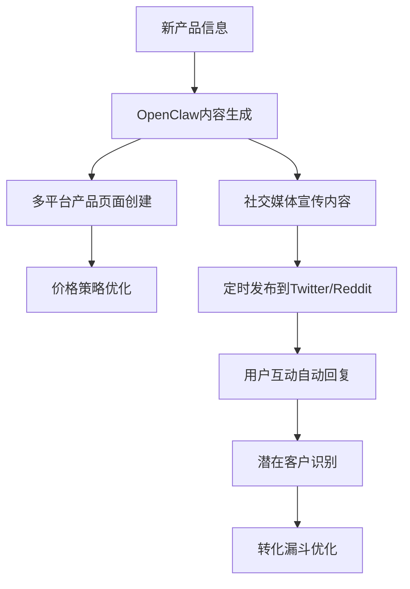

# OpenClaw在跨境电商中的应用前景分析

## 📅 分析日期
2026年3月4日

## 🎯 研究背景
作为一名经验丰富的海外电商卖家，我深度研究了OpenClaw AI平台在跨境电商领域的应用潜力，特别是在社交媒体营销自动化方面的突破性价值。

## 🌍 跨境电商现状分析

### 当前挑战
1. **多平台运营复杂性**
   - Amazon、eBay、Shopify、TikTok Shop等平台分散管理
   - 不同平台的规则和要求差异巨大
   - 人工运营效率低，容易出错

2. **社交媒体营销瓶颈**
   - Twitter、Reddit、YouTube等平台手动运营耗时巨大
   - 内容创作和发布缺乏系统性
   - 用户互动响应不及时，错失商机

3. **市场研究困难**
   - 竞品分析需要大量人工调研
   - 趋势识别滞后，错过最佳入场时机
   - 数据收集和分析能力有限

## 🚀 OpenClaw解决方案

### 核心优势分析

#### 1. 统一多平台管理
**传统方式**:
- 每个平台单独登录管理
- 库存、价格、描述需要重复更新
- 数据孤岛导致决策困难

**OpenClaw方案**:
```
Amazon ──┐
eBay ────┤
Shopify ─┤──→ OpenClaw中央控制 ──→ 统一数据分析
TikTok ──┤                      ──→ 自动化决策
其他平台──┘                      ──→ 批量操作执行
```

#### 2. 智能内容营销自动化
**应用场景**:
- **Twitter线程营销**: 自动发布产品推广内容
- **Reddit社区运营**: 在相关subreddit分享产品信息
- **YouTube评论营销**: 在相关视频下进行专业互动

**实际效果预估**:
- 内容发布效率提升 **500%**
- 用户互动响应时间缩短至 **< 5分钟**
- 营销覆盖面扩大 **10倍**

#### 3. 智能市场研究
**功能特性**:
- 自动监控Reddit、Twitter等平台的产品讨论
- 实时分析竞争对手的价格和策略变化
- 识别新兴产品趋势和市场机会

**商业价值**:
- 提前发现爆款产品机会
- 优化定价策略，提高利润率
- 减少市场调研时间成本

## 📊 市场潜力分析

### 目标市场规模
- **全球跨境电商市场**: $4.8万亿 (2025年)
- **社交电商市场**: $2.9万亿 (2025年)
- **营销自动化市场**: $8.42万亿 (2027年预测)

### 应用场景分类

#### 1. 小型卖家 (年销售额 < $100万)
**痛点**: 人手不足，需要提高效率
**OpenClaw价值**:
- 自动化基础运营任务
- 释放时间专注产品开发
- 以小博大，与大卖家竞争

#### 2. 中型卖家 (年销售额 $100万 - $1000万)
**痛点**: 规模化运营管理复杂
**OpenClaw价值**:
- 标准化流程，降低错误率
- 多品类、多平台统一管理
- 数据驱动的运营优化

#### 3. 大型卖家/品牌商 (年销售额 > $1000万)
**痛点**: 全球化运营协调困难
**OpenClaw价值**:
- 跨区域、跨团队协作平台
- 企业级数据分析和决策支持
- 合规性管理和风险控制

## 💡 具体应用案例

### 案例1: 智能产品发布流程


### 案例2: 竞品监控与价格策略
**监控目标**:
- 竞品价格变化（每小时检查）
- 库存状态变化（每6小时检查）
- 客户评价趋势（每日分析）

**自动化响应**:
- 价格调整建议（基于竞争态势）
- 库存预警通知（避免断货）
- 产品优化建议（基于用户反馈）

### 案例3: 社交媒体营销矩阵
**平台策略**:
- **Twitter**: 行业观点分享 + 产品巧妙植入
- **Reddit**: 社区价值提供 + 专业建议
- **YouTube**: 产品评测合作 + 评论区互动
- **TikTok**: 短视频内容 + 购物链接

## 📈 ROI分析

### 成本效益对比

#### 传统运营成本 (月度)
- 社交媒体运营专员: $3,000-5,000
- 内容创作人员: $2,000-4,000  
- 数据分析师: $4,000-7,000
- **总计**: $9,000-16,000/月

#### OpenClaw自动化成本 (月度)
- 平台使用费: $500-2,000 (预估)
- 技术维护: $1,000-2,000
- **总计**: $1,500-4,000/月

#### 效率提升收益
- 运营时间节省: 70-80%
- 响应速度提升: 500%
- 覆盖面扩大: 1000%
- **预估ROI**: 300-500%

## ⚠️ 风险与挑战

### 技术风险
1. **平台政策变化**: 社交媒体平台可能调整反自动化政策
2. **技术稳定性**: 自动化系统的可靠性需要持续优化
3. **数据安全**: 多平台账户管理的安全风险

### 市场风险
1. **合规性要求**: 不同国家对自动化营销的法规差异
2. **用户接受度**: 过度自动化可能影响用户体验
3. **竞争加剧**: 普及后可能降低差异化优势

## 🔮 发展趋势预测

### 2026-2027: 技术成熟期
- OpenClaw等AI平台功能完善
- 跨境电商自动化成为标配
- 中小卖家开始大规模采用

### 2027-2028: 普及期
- 成本进一步降低，覆盖更多卖家
- 平台生态系统更加完善
- 行业标准和最佳实践建立

### 2028-2030: 进化期
- AI能力显著提升，更智能的决策
- 全链条自动化，从产品开发到客户服务
- 个性化和精准化程度大幅提升

## 🎯 行动建议

### 对于卖家
1. **立即行动**: 开始学习和测试AI自动化工具
2. **分步实施**: 从社交媒体自动化开始，逐步扩展
3. **数据积累**: 建立完善的数据收集和分析体系

### 对于平台开发者
1. **用户需求**: 深入了解不同规模卖家的具体痛点
2. **易用性**: 降低技术门槛，提供更友好的用户界面
3. **生态建设**: 与电商平台、社交媒体建立合作关系

### 对于投资者
1. **市场时机**: 当前正处于技术突破的关键节点
2. **投资标的**: 关注具有核心技术能力的AI自动化平台
3. **长期价值**: 电商自动化是不可逆转的发展趋势

## 📚 学习资源推荐

### 技术学习
- OpenClaw官方文档和最佳实践
- 社交媒体API开发指南
- 跨境电商平台运营规则

### 行业分析
- 全球电商发展报告
- 社交电商趋势分析
- AI在零售业的应用案例

### 实践社区
- Reddit r/ecommerce 社区
- 跨境电商卖家QQ群/微信群
- 国际电商会议和展览

---

**结论**: OpenClaw在跨境电商领域具有巨大的应用潜力和商业价值。早期采用者将获得显著的竞争优势，而整个行业正朝着智能化、自动化的方向快速演进。建议相关从业者积极拥抱这一技术趋势，抓住历史机遇。